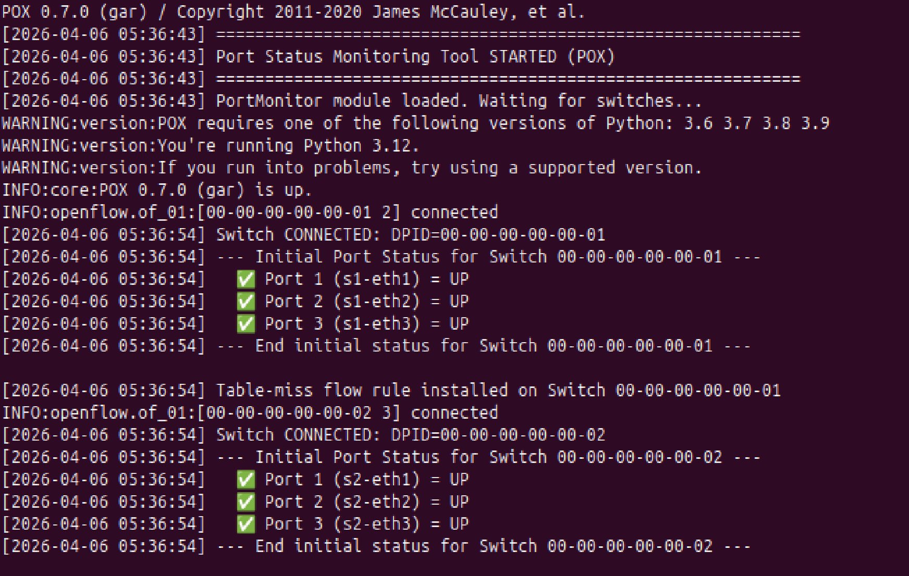
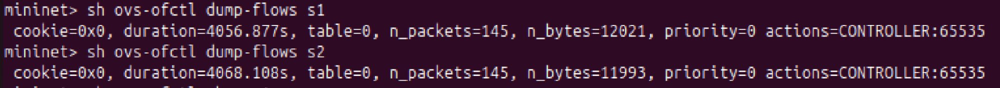
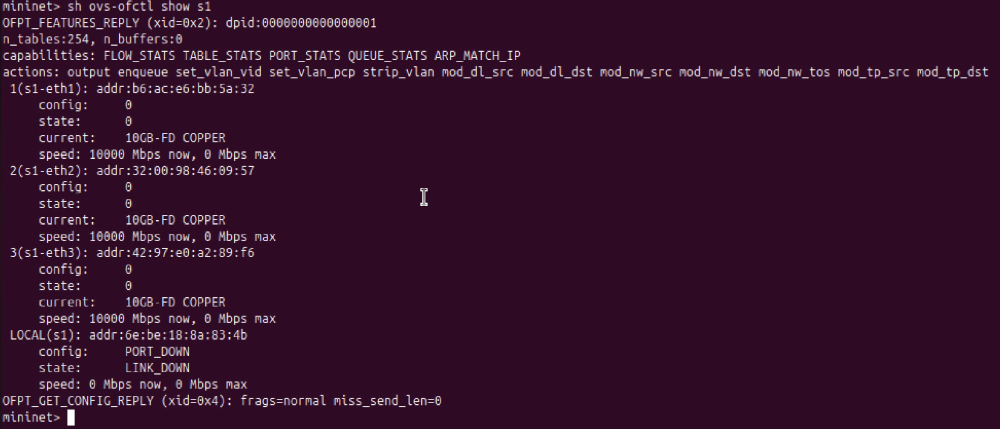
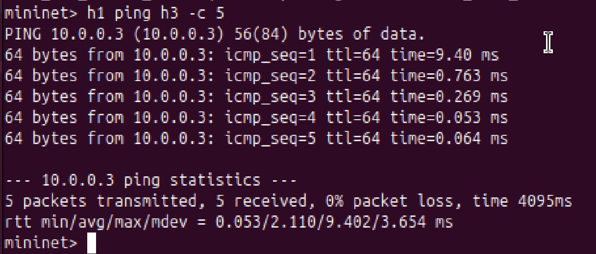
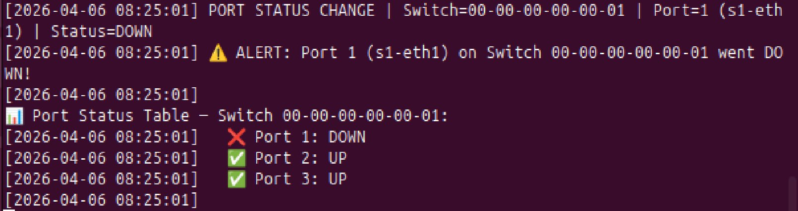
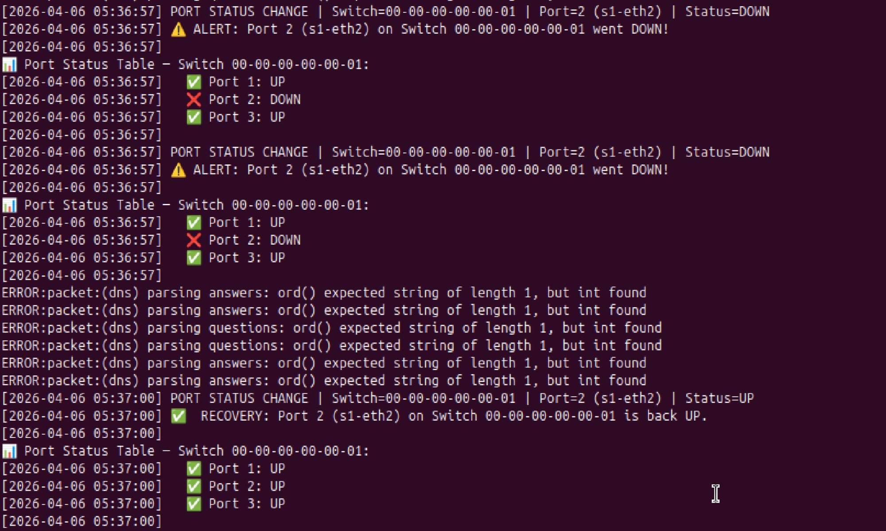
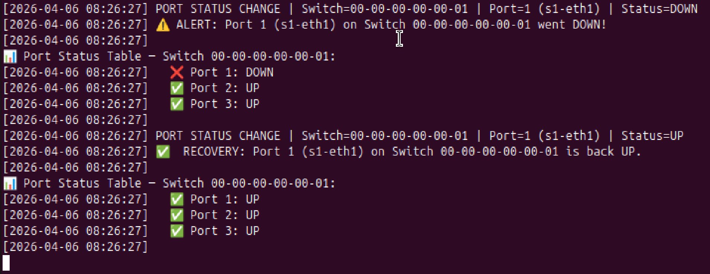

# SDN Port Status Monitoring Tool
**Project 13 | UE24CS252B – Computer Networks | PES University**

---

## Problem Statement

In Software Defined Networks (SDN), switches are controlled by a centralized controller. When a port on a switch changes state (goes UP or DOWN), the network must detect and respond immediately. This project implements a **Port Status Monitoring Tool** using Mininet and the POX OpenFlow controller that:

- Detects port UP/DOWN events in real time
- Logs all changes with timestamps to a file
- Generates instant alerts when ports fail
- Displays a live port status table per switch
- Acts as a MAC-learning switch for packet forwarding

---

## Architecture

```
    h1 (10.0.0.1) ─┐
    h2 (10.0.0.2) ─┴──── s1 ──── s2 ────┬── h3 (10.0.0.3)
                                          └── h4 (10.0.0.4)

    s1, s2  →  OVS Switches (OpenFlow 1.0)
    POX     →  SDN Controller on port 6633
```

- **2 switches** (s1, s2) connected to each other via inter-switch link
- **4 hosts** (h1–h4) with static IPs in the 10.0.0.0/24 subnet
- **POX controller** handles all OpenFlow events (ConnectionUp, PortStatus, PacketIn)

---

## Tech Stack

| Component | Tool |
|-----------|------|
| Network Emulator | Mininet 2.3.0 |
| SDN Controller | POX 0.7.0 (gar) |
| Protocol | OpenFlow 1.0 |
| OS | Ubuntu 24.04 (ARM64) |
| Validation | iperf, tshark, ovs-ofctl, Wireshark |

---

## Setup & Installation

### Prerequisites

```bash
sudo apt update && sudo apt upgrade -y --fix-missing
sudo apt install mininet git python3 wireshark tshark iperf net-tools -y
```

### Install POX

```bash
cd ~
git clone https://github.com/noxrepo/pox
cd pox
python3 pox.py --version   # Should print: POX 0.7.0 (gar)
```

### Clone This Repo

```bash
git clone https://github.com/YOUR_USERNAME/sdn-port-monitor.git
cd sdn-port-monitor
cp port_monitor.py ~/pox/ext/
```

---

## Running the Project

> You need **two terminals** open simultaneously.

### Terminal 1 — Start POX Controller

```bash
cd ~/pox
python3 pox.py openflow.of_01 --port=6633 port_monitor
```

### Terminal 2 — Start Mininet Topology

```bash
sudo python3 topology.py
```

---

## Proof of Execution

### 1. Controller Startup — Both Switches Connected & Initial Port Status

Both switches (s1 and s2) connect to the POX controller. All 3 ports on each switch are detected as UP and logged with timestamps.



> s1 connects → ports 1, 2, 3 all UP logged. s2 connects → ports 1, 2, 3 all UP logged. Table-miss flow rules installed on both switches.

---

### 2. Flow Tables — `ovs-ofctl dump-flows s1` and `s2`

The table-miss flow rule (priority=0, actions=CONTROLLER) is installed on both switches, confirming the OpenFlow control plane is active.



> Both s1 and s2 show `priority=0 actions=CONTROLLER:65535` — all unmatched packets are sent to the POX controller for MAC learning and forwarding decisions.

---

### 3. Switch Port Status — `ovs-ofctl show s1`

Detailed port information for s1 showing all 3 ports (s1-eth1, s1-eth2, s1-eth3) active at 10GB-FD COPPER.



> DPID: 0000000000000001 | Ports 1–3: state=0 (UP), speed=10000 Mbps each.

---

### 4. Ping Test — `h1 ping h3 -c 5`

h1 successfully pings h3 across two switches with 0% packet loss.



> 5 packets transmitted, 5 received, **0% packet loss** | RTT min/avg/max = 0.053/2.110/9.402 ms

---

### 5. Port DOWN Alert (Automated Test — h2 link)

When the h2 ↔ s1 link is brought down, the controller instantly detects the PortStatus event and fires an alert.



> Port 2 (s1-eth2) → **Status=DOWN** | Alert fired | Status table shows ❌ Port 2: DOWN, ✅ Ports 1 & 3: UP

---

### 6. Port DOWN → Recovery (Automated Test Cycle)

Full automated test cycle: Port 2 goes DOWN (alert), then comes back UP (recovery logged). Status table updates in real time.


> Port 2: DOWN → ⚠️ ALERT fired → Port 2: UP → ✅ RECOVERY logged | All ports back to UP

---

### 7. Port DOWN → Recovery (Manual Test — `link s1 h1 down/up`)

Manual test using Mininet CLI. Port 1 (s1-eth1 / h1's link) is brought down and then restored.



> `link s1 h1 down` → Port 1 DOWN alert | `link s1 h1 up` → Port 1 RECOVERY | All 3 ports confirmed UP

---

### 8. Ping + iperf + Manual Link Test

Combined view: h1 ping h3 succeeds (0% loss), iperf TCP bandwidth test initiated, manual link down/up commands executed successfully.



> `h1 ping h3 -c 5` → 0% loss | `iperf h1 h3` → TCP bandwidth test | `link s1 h1 down/up` → manual port control confirmed

---

## Test Scenarios Summary

| # | Scenario | Command | Result |
|---|----------|---------|--------|
| 1 | Basic connectivity | `pingall` | 0% dropped (12/12) ✅ |
| 2 | Port failure (automated) | h2↔s1 link down | ⚠️ ALERT fired instantly ✅ |
| 3 | Port recovery (automated) | h2↔s1 link up | ✅ RECOVERY logged ✅ |
| 4 | Post-recovery ping | `pingall` | 0% dropped (12/12) ✅ |
| 5 | Manual port down | `link s1 h1 down` | ⚠️ ALERT Port 1 DOWN ✅ |
| 6 | Manual port up | `link s1 h1 up` | ✅ RECOVERY Port 1 UP ✅ |
| 7 | Latency measurement | `h1 ping h3 -c 5` | RTT avg 2.110 ms ✅ |
| 8 | Throughput test | `iperf h1 h3` | TCP bandwidth measured ✅ |

---

## SDN Concepts Demonstrated

- **Controller–Switch interaction** via OpenFlow 1.0
- **packet_in event handling** with MAC address learning
- **Match–action flow rules** installed dynamically per flow
- **PortStatus event monitoring** (OFPPR_ADD / MODIFY / DELETE)
- **Table-miss flow entry** (priority=0, send to controller)
- **Flow timeouts** (idle: 30s, hard: 120s) for stale rule cleanup

---

## File Structure

```
sdn-port-monitor/
├── port_monitor.py       ← POX controller (main logic)
├── topology.py           ← Mininet topology + automated tests
├── port_status_log.txt   ← Auto-generated timestamped log
└── README.md
```

---

## Cleanup

```bash
sudo mn -c        # Clean up Mininet state
Ctrl+C            # Stop POX controller
```

---

## References

1. Mininet Documentation — https://mininet.org/overview/
2. POX Wiki — https://noxrepo.github.io/pox-doc/html/
3. OpenFlow 1.0 Specification — https://opennetworking.org/
4. Mininet Walkthrough — https://mininet.org/walkthrough/
5. OVS Documentation — https://docs.openvswitch.org/
6. Mininet GitHub — https://github.com/mininet/mininet
